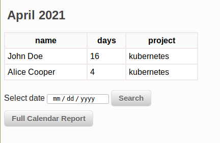

[](https://circleci.com/gh/Kartones/flask-calendar/tree/master)

# flask-calendar

## Introduction

In 2021, I started looking for a calendar for DevOps on duty. The main task was simple and convenient maintenance of the duty schedule and REST API for sending a message and making calls to the duty officers during an incident. Also, one of the criteria was authorization through the Active directory and the presence of duty reports. And of course the system was supposed to be Open Source and free. Unfortunately, I haven't found the perfect system for myself. In the course of my research, I came across an amazing calendar from Kartones (https://github.com/Kartones/flask-calendar) and I decided to fork it and write the perfect accounting system for Devops duty on my own

## System Features

* Duty Schedule calendar system
* Duty reports
* Repetitive shift 
* REST API for call to active or backup Duty
* Send messages to telegram, Slack, email
* Support custom call providers
* Reminder of the beginning of duty
* Reminder to the project manager of an unfilled schedule

## Requirements

- Python 3.5+ (type hints are compatible with 3.5 upwards)

Other requirements are on the `requirements.txt` file. Install them with `pip` or similar.

## How to install it?

System tested on Centos7

run the following command to install:
```
bash -c "$(wget -O - https://raw.githubusercontent.com/mercury131/flask-calendar/master/install_on_centos7.sh)" 
```

After setup edit `config.py` and fill in or adapt to your needs.

Also convert your Active Directory CA certificate to PEM:

```
openssl x509 -inform der -in ca_name.cer -out ca_name.pem
```

## How to use it?

### First step. Add your Active Directory CA certificate on server and convert to PEM

```
openssl x509 -inform der -in ca_name.cer -out ca_name.pem
```
Set certificate path in config file /var/www/flask-calendar/config.py, for example:

```
USE_LDAP = "true"
CACERT = '/home/darkwind/flask-ldap/ca_name.pem'
```

Next step, create groups in Active Directory for calendar admins and readonly users, add groups in config:
```
ALLOWGROUP_RO = "CN=duty-access-ro,CN=Users,DC=test,DC=com"
ALLOWGROUP_RW = "CN=duty-access,CN=Users,DC=test,DC=com"
```

Also add your domain controller server and domain name and OU in config:
```
LDAPSERVER = "srv1.test.com"
OU = "dc=test,dc=com"
DOMAIN = "TEST.COM"
```

### Setup KEYS

Enter keys for DB and encryption,  something complicated with different case capital letters and numbers
```
SECRET_KEY = "JMkladjawoidu3w85h2u5g25uygk3yhfgeks"
PASSWORD_SALT = "AHKUFj4hiw538thv4t89wygyw85fm93p23y4x,rghe54iy6m2"
```

### Setup call back proveders
Setup call back proveders, your duty can receive notifications from Telegram,Slack, Email. 
Also you can use custon external providers via REST API Constructor

```
USE_TELEGRAM = 'no'
TELEGRAM_API_ID = ''
TELEGRAM_API_HASH = ''
TELEGRAM_BOT_TOKEN = ''
TELEGRAM_MESSAGE = 'Alert Detected!'

USE_SLACK = 'no'
SLACK_APP_TOKEN= ''
SLACK_MESSAGE = 'Alert Detected!'

USE_EMAIL = 'no'
SMTP_SERVER = ''
SMTP_PORT = '587'
SMTP_LOGIN = ''
SMTP_PASSWORD = ''
SENDER_ADDRESS = ''
EMAIL_MESSAGE = 'Alert Detected!'
EMAIL_SUBJECT = 'Alert Detected!'
```
REST API Constructor:
```
USE_REST1 = 'yes'
# <DUTY1> <DUTY2> <PROJECT> <EMAIL1> <EMAIL2> <ARG1> <ARG2> <ARG3> <ARG4>
REST1_URL = 'http://0.0.0.0:5000/test/<DUTY1>&<DUTY2>@out&extension=<ARG1>&context=play&timeout=900'
REST1_METHOD = 'POST'
REST1_AUTH = 'yes'
REST1_USER = 'admin'
REST1_PASSWORD = '12345'
REST1_ARG1 = 'hello-world'
REST1_ARG2 = ''
REST1_ARG3 = ''
REST1_ARG4 = ''
```
In Constructor you can post active duty, backup duty, project, emails and some custom arguments

### Login to Calendar

Add your users to Active Directory groups and login in calendar after that


### Add Duty and Projects
Enter manage duty button after login and press + button

fill the form


### Add Project managers (if you need them)

Press PM button


Add Project managers via + button and fill the form


You can edit entries or delete them at any time


### Fill in the schedule

Open calendar main window and press + button to add new schedule


Then fill the form (select your project,active and backup duty)


Also you can use repetitive shift if your shifts do not change from month to month


After filling in the schedule, you will see it in the calendar


If you check on task, you will see backup duty


### How to change the days of duty if a repeating schedule is used?
if you use a recurring schedule but want to change days this month, press the H button on the schedule date

After that add regular task to day


### How to use Calendar REST API?
You can use Calendar REST API with your monitoring system.
Setup your call back providers in calendar config file

After that login to calendar and register API toket by following URL:
```
http://calendar.local/api/register/
```
You will get new token
```
[
  "Token for test created.",
  "token: f84bf001-0599-41d4-bc6a-89118c974db6"
]
```
Save this token

#### How to call to active duty via RESR API?

To call active duty use followind request:
```
http://calendar.local/call/kubernetes/test&f84bf001-0599-41d4-bc6a-89118c974db6
```
You can use POST or GET requests if your system not support POST

After that you will see response:
```
["Send REST request to:","http://calendar.local/test/<DUTY1>&<DUTY2>@out&extension=<ARG1>&context=play&timeout=900"," complete successfully"]
```
In that example I call to active duty on project kubernetes via my active directory account test and token f84bf001-0599-41d4-bc6a-89118c974db6

If you want, you can call to backup duty via followind request:
```
http://calendar.local/call/kubernetes/test&f84bf001-0599-41d4-bc6a-89118c974db6&secondary
```
And you can override call provider and use only Telegram for example:
```
http://calendar.local/call/kubernetes/test&f84bf001-0599-41d4-bc6a-89118c974db6&secondary&telegram
```
Of cource you can use Slack,email or custom provider (&rest1,&rest2,etc), not only Telegram

#### Override call proveder for project
If you dont want to use default provider in config you can change that for your project.
For example project kubernetes want receive messages only in Telegram and Slack
Press api icon on main calendar page

Press + button to add api mapping
Fill api mapping form

You can use this providers: telegram,slack,rest1(1234),email

#### Token expiration
Calendar will send a message one month before the token expires. 
To update token, login to calendar and go to following url to update your token:
```
http://calendar.local/api/update/

["Token for test updated.","token: 651db9f5-4b3c-41cc-8536-b8f6302a6752"]
```

### Schedule Reports
To see schedule reports press report button


You will see days report


Press "Full calendar report" button on same page to see month report


You can select another month via "Select date" form
### Details

Main calendar view:


Create new task view:


Supports a basic drag & drop on desktop of days (like Google Calendar), edition of existing tasks, creation of repetitive tasks (daily, montly, by weekday, by month day or on specific day number), custom colors, and a few options like hiding past tasks or being able to manually hide those repetitive task ocurrences (I like a "clean view" and usually remove/hide past tasks).

It is mobile friendly (buttons for actions are ugly and cannot drag & drop days on mobile, but otherwise works), might not be perfectly designed for all resolutions but at least works.


## Remarks

Compatible with Firefox, Brave and Chrome. No plans for other browser support (but PRs are welcome).

No Javascript libraries and no CSS frameworks used, so this means the corresponding code and styles are accordingly non-impressive.

No databases, as I don't need to do any querying or complex stuff I couldn't also do with JSON files and basic dictionaries.

Authentication works using werkzeug SimpleCache for storage, which means if the application runs with more than one thread you'll get into problems. Run it with a single process uwsgi or similar.

HTML inputs are favoring HTML5 ones instead of fancy jquery-like plugins to reduce support and increase mobile compatibility.

Sample username is `a_username` with password `a_password` (if you disable Active Directory support).

### Locale

`dev` Dockerfile installs a sample locale (`es_ES`), but does not activate it. Refer to that file and to the `config.py` file for setting up any locale or commenting the lines that install them to speed up container bootup if you're sure don't want them.

Remember you can check which locales you have installed with `locale -a` and add new ones with the following commands:
```bash
cd /usr/share/locales
sudo ./install-language-pack es_ES
sudo dpkg-reconfigure locales
```


### Testing

- Run tests:
```bash
make test
```

- Extract code coverage:
```bash
make coverage
```

## Virtualenv Environment

1. Create the virtual environment:
```bash
$ python3 -m venv .venv
```

2. Activate it:
```bash
$ source .venv/bin/activate
```

3. Install dependencies (in the virtual environment):
```bash
(.venv) $ pip install -r requirements.txt
(.venv) $ pip install -r requirements-dev.txt
```

4. You are now ready to run the test, extract coverage or run a testing server:
```bash
(.venv) $ # Run tests
(.venv) $ pytest

(.venv) $ # Extract coverage into './cov_html' folder
(.venv) $ pytest --cov-report html:cov_html  --cov=. --cov-config .coveragerc

(.venv) $ # Run testing server
(.venv) $ python -m flask_calendar.app
```

## Miscellaneous

### User creation/deletion (when Active Directory support disabled)

As there is no admin interface, to create or delete users you should create a python file with code similar to the following example:

```python
from authentication import Authentication
import config


authentication = Authentication(data_folder=config.USERS_DATA_FOLDER, password_salt=config.PASSWORD_SALT)

# Create a user
authentication.add_user(
    username="a username",
    plaintext_password="a plain password",
    default_calendar="a default calendar id"
)

# Delete a user
authentication.delete_user(username="a username")
```
